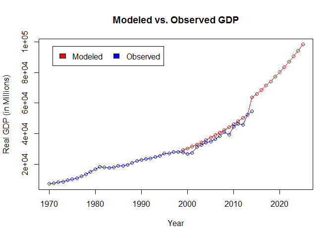

Calibrating the Neoclassical Growth Model to Paraguay
================
Paul Ervin
2017-08-07

Introduction
------------

The purpose of this document is to show how to calibrate the neoclassical growth model. The example shown here is for Paraguay, but the same method could be applied to any country where data is available. I begin by introducing the model. Then, I perform the calibration, forecast GDP to the year 2025, and explore a counterfactual investment shock.

The Neoclassical Growth Model
-----------------------------

In its simplest form the neoclassical growth model is defined by the following set of equations:

-   
    *Y*<sub>*t*</sub> = *K*<sub>*t*</sub><sup>*α*</sup>(*A*<sub>*t*</sub>*L*<sub>*t*</sub>)<sup>(1 − *α*)</sup>
-   
    *K*<sub>*t* + 1</sub> = *I*<sub>*t*</sub> + (1 − *δ*)*K*<sub>*t*</sub>
-   
    *L*<sub>*t* + 1</sub> = (1 + *g*<sub>*L*</sub>)*L*<sub>*t*</sub>
-   
    *A*<sub>*t* + 1</sub> = (1 + *g*<sub>*A*</sub>)*A*<sub>*t*</sub>,

along with initial conditions for *K*<sub>0</sub>, *L*<sub>0</sub>, and *A*<sub>0</sub>. *Y*<sub>*t*</sub> is total output measured by real GDP in constant dollars. Total ouput is produced by a Cobb-Douglas production function with capital *K*<sub>*t*</sub>, labor input *L*<sub>*t*</sub>, and productivity *A*<sub>*t*</sub>. The parameter *α*, with 0 &lt; *α* &lt; 1, is referred to as the "physical capital share."

Labor *L*<sub>*t*</sub> and productivity *A*<sub>*t*</sub> grow at exogenous growth rates of *g*<sub>*L*</sub> and *g*<sub>*A*</sub>, respectively. But capital *K*<sub>*t*</sub> is determined by physical capital accumulation, i.e. the "law of motion capital", where future capital *K*<sub>*t* + 1</sub> is determined by investment *I*<sub>*t*</sub>, with the savings rate *s*<sub>*t*</sub> = *I*<sub>*t*</sub>/*Y*<sub>*t*</sub>, and the rate of depreciation *δ*.

Data
----

To use the code in this section you will first need to set your working directory. This can be done with

``` r
setwd("C:/.../your_working_directory")
```

Additionaly observations and variables are selected and created using the functions `select`, `filter`, and `mutate` from the tidyverse package. To install and activate the tidyverse use

``` r
install.packages("tidyverse")
library(tidyverse)
```

Data used to calibrate the neoclassical growth model is available in the Penn World Table. The data can be downloaded directly in R using the code

``` r
fileUrl <- "http://www.rug.nl/ggdc/docs/pwt90.xlsx"
download.file(fileUrl, destfile="pwt90.xlsx", method="curl")
```

Once you have downloaded the file pwt90.xlsx, open the file in Excel. Sheet two of pwt90.xlsx provides variable definitions. The third sheet contains the data used to calibrate the neoclassical growth mode. Save sheet three as pwt90.csv in your working directory.

After saving sheet three of pwt90.xlsx as a csv file, the data can be accessed in R with

``` r
GrowthData <- read.table("pwt90.csv", sep=",", header=TRUE)
```

and you can investigate the data with `head(GrowthData)`, `tail(GrowthData)`, and `summary(GrowthData)` or any other method you chose.

Now select out Paraguay, for which there are observations after the year 1970 with

``` r
GrowthData <- GrowthData %>% 
  filter(country == "Paraguay", year>=1970)
```

and select the variables used in the calibration with

``` r
GrowthData <- GrowthData %>% 
  select(country, year, pop, emp, avh, rgdpna, rkna, rtfpna, labsh, delta)
```

Calibration
-----------

Calibration of the neoclassical growth model presented above is based on the following assumptions:

1.  Each variable grows at a constant rate ("Balanced Growth Path" assumption).
2.  The savings rate is constant, *s*<sub>*t*</sub> = *s*.

To begin, I specify a cutoff year. I specify the year 1999, that is data before 1999 will be used to calibrate the model, so that I can compare the model with the observed data after 1999.

``` r
cutoffyear <- 1999
```

Next, from the data, I obtain the average depreciation rate *δ* and calculate the labor and capital shares, 1 − *α* and *α*, respectively.

``` r
avgdelta <- mean(GrowthData$delta[GrowthData$year<cutoffyear])
avglabshare <- mean(GrowthData$labsh[GrowthData$year<cutoffyear])
avgcapshare <- (1-avglabshare)
```

I calculate the average growth rate for labor *g*<sub>*L*</sub>, between 1970 and the cutoff year as

``` r
gl <- (log(GrowthData$emp[GrowthData$year==(cutoffyear-1)])-log(GrowthData$emp[GrowthData$year==1970]))/((cutoffyear-1)-1970)
```

The average savings rate *s* can be calculated from the data using the law of motion of capital to calculate investment *I*<sub>*t*</sub>. Formally, *I*<sub>*t*</sub> = *K*<sub>*t* + 1</sub> − (1 − *δ*)\**K*<sub>*t*</sub>, and recall *s* = *I*<sub>*t*</sub>/*Y*<sub>*t*</sub>.

``` r
GrowthData <- mutate(GrowthData, rina = lead(rkna)-(1-avgdelta)*rkna)
GrowthData <-mutate(GrowthData, s = rina/rgdpna)
avgs <- mean(GrowthData$s[GrowthData$year<cutoffyear])
```

Additonally, from the law of motion of capital and the production function

-   *K*<sub>*t* + 1</sub> = *s* \* *Y*<sub>*t*</sub> + (1 − *δ*)*K*<sub>*t*</sub>
-   =&gt; *K*<sub>*t* + 1</sub> = *s* \* *K*<sub>*t*</sub><sup>*α*</sup>(*A*<sub>*t*</sub>*L*<sub>*t*</sub>)<sup>(1 − *α*)</sup> + (1 − *δ*)*K*<sub>*t*</sub>
-   =&gt; (*g*<sub>*K*</sub> + *δ*)*K*<sub>*t*</sub>/(*A*<sub>*t*</sub>*L*<sub>*t*</sub>)=*s* \* (*K*<sub>*t*</sub>/(*A*<sub>*t*</sub>*L*<sub>*t*</sub>))<sup>*α*</sup>
-   =&gt; (*g*<sub>*K*</sub> + *δ*)/*s* = ((*A*<sub>*t*</sub>*L*<sub>*t*</sub>)/*K*<sub>*t*</sub>)<sup>(1 − *α*)</sup>

implies *g*<sub>*A* \* *L*</sub> = *g*<sub>*K*</sub>, because the right-hand-side of the above equation is a ratio of time-invariant constants. And from the production function

-   *Y*<sub>*t*</sub> = *K*<sub>*t*</sub><sup>*α*</sup>(*A*<sub>*t*</sub>*L*<sub>*t*</sub>)<sup>(</sup>1 − *α*)
-   =&gt; log(*Y*<sub>*t*</sub>)=*α* \* log(*K*<sub>*t*</sub>)+(1 − *α*)\*log(*A*<sub>*t*</sub> \* *L*<sub>*t*</sub>)
-   =&gt; *g*<sub>*Y*</sub> = *α* \* *g*<sub>*K*</sub> + (1 − *α*)\**g*<sub>*A* \* *L*</sub>
-   =&gt; *g*<sub>*Y*</sub> = *g*<sub>*K*</sub>
-   =&gt; *g*<sub>*Y*</sub> = *g*<sub>*A*</sub> + *g*<sub>*L*</sub>

Therfore, I obtain the growth rate of output *g*<sub>*Y*</sub> and use it caluclate the growth rate of productivity *g*<sub>*A*</sub>.

``` r
gy <- (log(GrowthData$rgdpna[GrowthData$year==(cutoffyear-1)])-log(GrowthData$rgdpna[GrowthData$year==1970]))/((cutoffyear-1)-1970)
ga <- gy-gl
```

Finally, I calculate total factor productivity *A*<sub>*t*</sub> from the production function as

``` r
GrowthData <- mutate(GrowthData, tfp = (rgdpna^(1/(1-avgcapshare)))/(emp*(rkna^(avgcapshare/(1-avgcapshare)))))
```

Now all the paramaters to run the model have been calibrated. Before running the model, I copy the variables I will use in the model and I add years to the data to use the model to predict into the future.

``` r
GrowthData <- mutate(GrowthData, memp = emp)
GrowthData <- mutate(GrowthData, mtfp = tfp)
GrowthData <- mutate(GrowthData, mrkna = rkna)
GrowthData <- mutate(GrowthData, mrgdpna = rgdpna)

for(i in 2015:2025) {
   GrowthData[nrow(GrowthData)+1, ] <- as.list(c(NA, i, rep(NA, 14)))
}
```

Running the Model
-----------------

The calibrated parameters are applied to the data using the code below

``` r
for(i in cutoffyear:2025) {
  GrowthData$memp[GrowthData$year==i] <- GrowthData$memp[GrowthData$year==(i-1)]*(1+gl)
  GrowthData$mtfp[GrowthData$year==i] <- GrowthData$mtfp[GrowthData$year==(i-1)]*(1+ga)
  GrowthData$mrkna[GrowthData$year==i] <- avgs*GrowthData$mrgdpna[GrowthData$year==(i-1)]+(1-avgdelta)*GrowthData$mrkna[GrowthData$year==(i-1)]  
  GrowthData$mrgdpna[GrowthData$year==i] <- (GrowthData$mrkna[GrowthData$year==i]^avgcapshare)*(GrowthData$mtfp[GrowthData$year==i]*GrowthData$memp[GrowthData$year==i])^avglabshare 
}
```

and the following code plots the results.

``` r
plot(GrowthData$year, GrowthData$mrgdpna,
     type = "o",col = "red", xlab = "Year",   
     ylab = "Real GDP (in Millions)", 
     main = "Modeled vs. Observed GDP")

lines(GrowthData$year, GrowthData$rgdpna, type = "o", col = "blue")
legend("topleft", inset=.05,
       c("Modeled","Observed"), fill=c("red", "blue"), horiz=TRUE)
```


Additionally, the model can be modified to explore an investment shock, or other shocks you might want to explore. An example of an investment shock in 2014 is modeled below.

``` r
for(i in cutoffyear:2025) {
  GrowthData$memp[GrowthData$year==i] <- GrowthData$memp[GrowthData$year==(i-1)]*(1+gl)
  GrowthData$mtfp[GrowthData$year==i] <- GrowthData$mtfp[GrowthData$year==(i-1)]*(1+ga)
  if (i==2014) {
   GrowthData$mrkna[GrowthData$year==i] <- avgs*GrowthData$mrgdpna[GrowthData$year==(i-1)]+(1-avgdelta)*GrowthData$mrkna[GrowthData$year==(i-1)]+GrowthData$mrkna[GrowthData$year==(i-1)]*0.35
  } else {
    GrowthData$mrkna[GrowthData$year==i] <- avgs*GrowthData$mrgdpna[GrowthData$year==(i-1)]+(1-avgdelta)*GrowthData$mrkna[GrowthData$year==(i-1)]
  }
    GrowthData$mrgdpna[GrowthData$year==i] <- (GrowthData$mrkna[GrowthData$year==i]^avgcapshare)*(GrowthData$mtfp[GrowthData$year==i]*GrowthData$memp[GrowthData$year==i])^avglabshare 
}
```

And the investment shock can be seen in the plot below.

``` r
plot(GrowthData$year, GrowthData$mrgdpna,type = "o",col = "red", xlab = "Year", ylab = "Real GDP (in Millions)", 
     main = "Modeled vs. Observed GDP")

lines(GrowthData$year, GrowthData$rgdpna, type = "o", col = "blue")
legend("topleft", inset=.05,
       c("Modeled","Observed"), fill=c("red", "blue"), horiz=TRUE)
```



Conclusion
----------

In this document, I calibrated the neoclassical growth model to Paraguayan data. The calibrated paramaters can further be used to decompose the sources of economic growth. Interested readers are recommended to see the following sources:

-   Choi, Seung Mo; Economic Growth Lecture Notes, 2012. <https://sites.google.com/site/seungmochoi/502growth.pdf>
-   Hall, R. E., & Jones, C. I. (1999). Why do some countries produce so much more output per worker than others?. The quarterly journal of economics, 114(1), 83-116.
